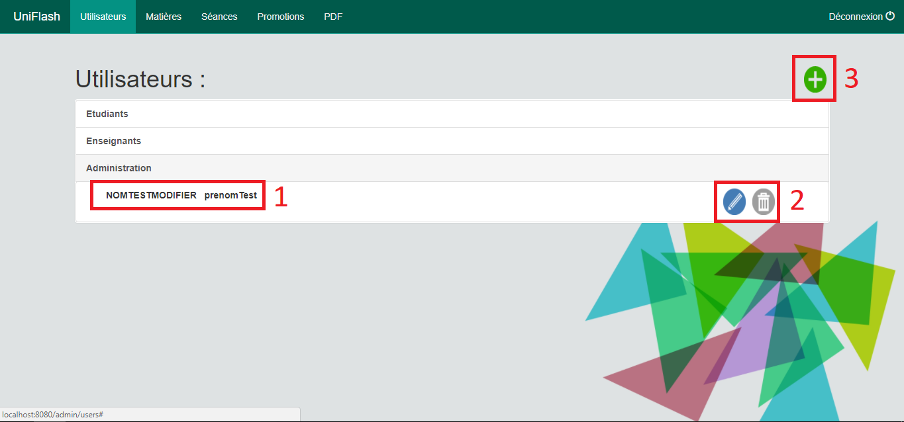
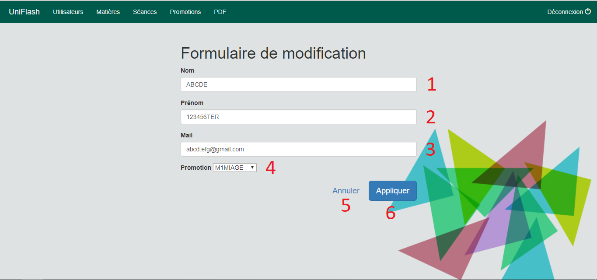
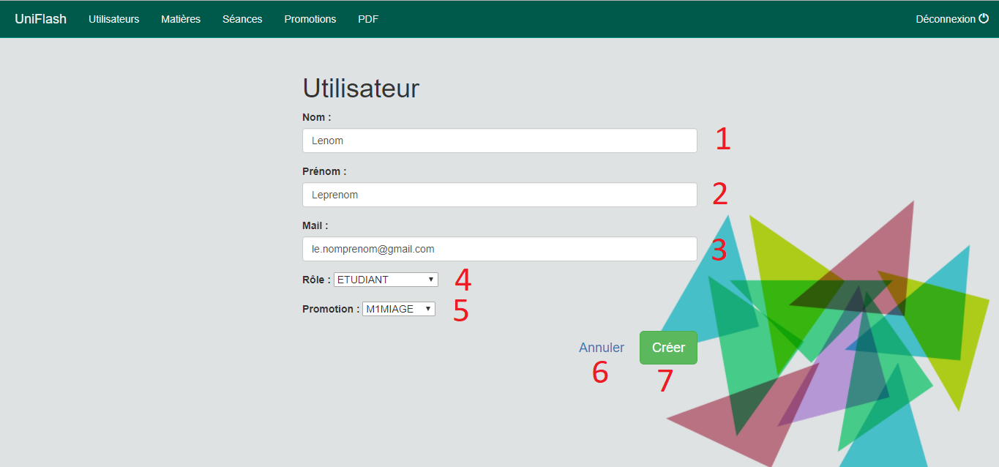
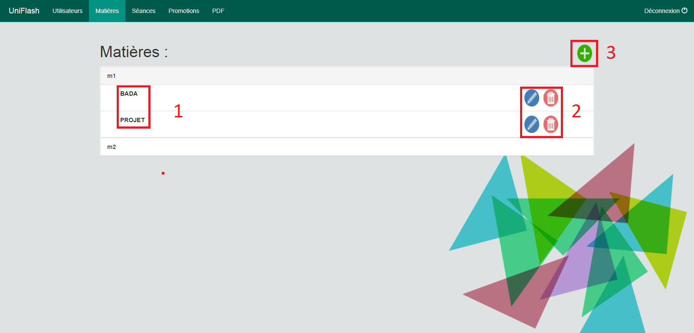

# Documentation utilisateur :

## Barre de navigation :

  

L'utilisateur du site trouvera  la barre de menu suivante sur l'intégralité des vues du site (administration). 
Cette barre permet de réalisé plusieurs action qui permettent de simplifier la navigation entre les différentes vues.
Fonction de gauche à droite :
* Bouton de retour vers l'accueil 
* Le bouton utilisateurs permet d'afficher la vue global contenant les différents utilisateurs
* Le bouton matières permet d'afficher la vue global contenant les différentes matières disponnibles
* Le bouton séances permet d'afficher la vue global contenant les différentes séances
* Le bouton promotions permet d'afficher la vue global contenant les différene promotions
* Le bouton PDF permet de séléctionner la fiche de présence que l'on souhaite afficher
* Le bouton déconnexion va permettre à l'utilisateur de se déconnecter du site

## Présentation des vues administrateurs :

L'administrateur a accès à différentes vues qui lui permette de gérer les différents éléments qui seront nécéssaire afin de renseigner  
la fiche de présence.  

Ces vues sont les suivantes :

### Vues "Utilisateurs" :

Cette vue va afficher à l'administrateur l'intégralité des utilisateurs présents danbs la base de données.
Les numéros affichés représentes les fonctionnalités disponnibles dans cette vue :
1) Affichage du "Nom',"Prénom" et "Promotion" (uniquement pour les étudiants) trié en fonction de leur rôle
2) Ici,  le bouton de gauche permet de modifier les informations d'un utilisateur. Et le second bouton permet de supprimer l'utilisateur
sélectionner ( /!\ dans l'exemple ici, le bouton est grisé car l'administrateur ne peut pas se supprimer lui même /!\ )
3) Ce bouton permet d'ajouter un utilisateur

#### Modification d'un utilisateur :

Cette interface va nous donner la possibilité de modifier les informations liées à un utilisateur :
1) Modification du Nom 
2) Modification du Prénom 
3) Modification de l'adresse e-mail
4) Sélection de la promotion
5) Bouton permettant d'annuler les modifications
6) Bouton permettant d'appliquer les modifications apportées 

#### Création d'un utilisateur :

Cette interface nous donne la possibilité de créer un compte utilisateur :
1) Création du Nom 
2) Création du Prénom 
3) Création de l'adresse e-mail
4) Sélection du role de l'utilisateur (Choix entre "Etudiant", "Enseignant" et "Administration")
5) Sélection de la promotion
6) Bouton permettant d'annuler les modifications
7) Bouton permettant de créer l'utilisateur

#### Vues "Matières" :

Cette vue va afficher à l'administrateur l'intégralité des matières présentes dans la base de données.
Les numéros affichés représentes les fonctionnalités disponnibles dans cette vue :
1) Affichage des matières qui sont triées par promotion
2) * Bouton bleu : permet de modifier une matière
   * Bouton Rouge : permet de supprimer une matière
3) Bouton permettant de créer une nouvelle matière

