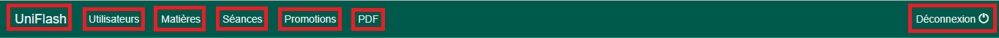

# Documentation utilisateur :

## Barre de navigation :

  

L'utilisateur du site trouvera  la barre de menu suivante sur l'intégralité des vues du site (administration). 
Cette barre permet de réalisé plusieurs action qui permettent de simplifier la navigation entre les différentes vues.
Fonction de gauche à droite :
* Bouton de retour vers l'accueil 
* Le bouton utilisateurs permet d'afficher la vue global contenant les différents utilisateurs
* Le bouton matières permet d'afficher la vue global contenant les différentes matières disponnibles
* Le bouton séances permet d'afficher la vue global contenant les différentes séances
* Le bouton promotions permet d'afficher la vue global contenant les différene promotions
* Le bouton PDF permet de séléctionner la fiche de présence que l'on souhaite afficher
* Le bouton déconnexion va permettre à l'utilisateur de se déconnecter du site

## Présentation des vues administrateurs :

